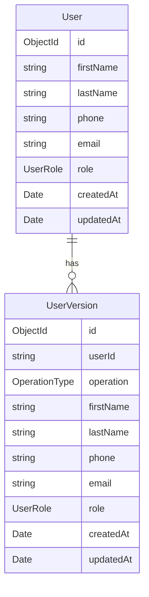
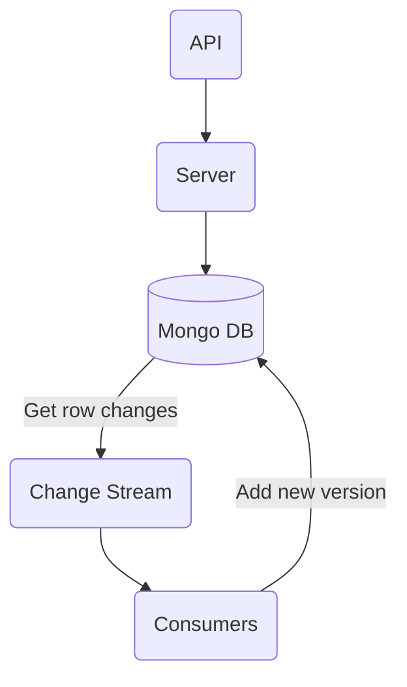

## Team Members

### Project Goal

Develop an HTTP API for a team-member management application, with data
persistence in Mongodb. All actions should be stored in the database.

### Assumptions

Multi-user cases or authentication aren't implemented. Assuming all clients see
the same list of team members.

### Database Design

One user has multiple version based on update.



### Flow Diagram

To store versions, I have used change stream of MongoDB. All the operations are
caught in the change stream and stored in another collection.



### Installation

```
npm install --force
```

### Running

This project requires a MongoDB cluster with replication enabled to activate
change streams.

#### Docker

There is a `docker-compose.yml` file for starting Mongo cluster.

```bash
docker-compose up
```

#### Dropping MongoDB Collections

To drop collections in MongoDB, use the drop() method. This is required to avoid
errors.

```bash
mongosh
use sample
```

```javascript
db.user_versions.drop();
db.users.drop();
```

#### Run the project

Set the environment variables for the database name **(DB_NAME)** and URL
**(DB_URL)**:

```bash
export DB_NAME=sample
export DB_URL=mongodb://localhost:27017
```

Then, run Nest as usual:

```bash
npm start
```

### Endpoint Details

Make sure to restart the service if you drop the collection.

#### Adding a Team Member

```bash
curl --location 'localhost:3000/users' \
--header 'Content-Type: application/json' \
--data-raw '{
    "firstName": "John",
    "lastName": "Doe",
    "email": "john@doe.com",
    "phone": "+919999999999",
    "role": "admin"
}'
```

#### Editing a Team Member

```bash
curl --location --request PUT 'localhost:3000/users/:user_id' \
--header 'Content-Type: application/json' \
--data-raw '{
    "email": "hello@johndoe.com"
}'
```

#### Listing Team Members

```bash
curl --location 'localhost:3000/users'
```

#### Getting a Team Member

```bash
curl --location 'localhost:3000/users/:user_id'
```

#### Deleting a Team Member

```bash
curl --location --request DELETE 'localhost:3000/users/:user_id'
```

#### Getting a Team Member Versions

```bash
curl --location 'localhost:3000/users/:user_id/versions'
```

### Future Improvements

We need to keep track of the pointer ID for changes in the change stream.
Currently, it is missing. It can be synchronized in Redis. In the current
scenario, server shutdowns can cause us to miss the changes if the data is
modified.

To make it more resilient, we can implement
[Debezium + Kafka](https://debezium.io/documentation/reference/stable/connectors/mongodb.html)
to directly sync changes to the database. This approach eliminates some
implementations but comes with a higher learning curve and added expense.
Additionally, it is less flexible.

Currently, all users have the ability to change anything, indicating a need for
improvement. Additionally, implementing pagination could enhance speed. However,
some indexes are missing, which is an area that could be improved.

Regarding quality assurance (QA), the addition of test cases is crucial.
Although I've integrated the framework, the test cases are still missing. With
this, proper error handling could be addressed.
